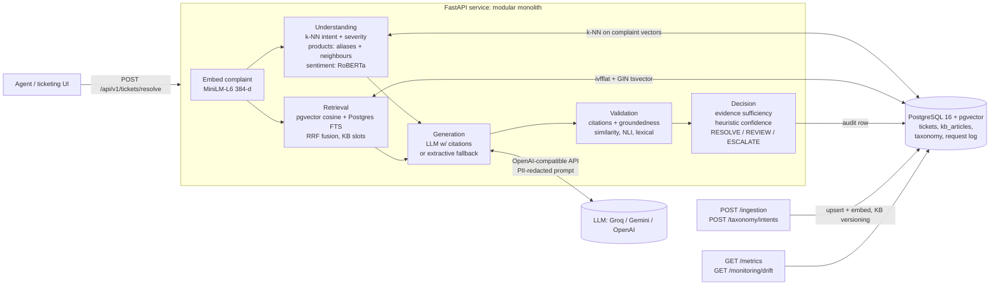

# Architecture

## 1. Problem framing

Support agents search past tickets and the KB by keyword ("router", "billing"). Keyword search misses tickets
that describe the **same root cause in different words** ("the web keeps cutting out" vs "broadband drops"), so
agents re-solve known problems, resolution quality varies by agent, and handle time grows.

The assistant takes a raw complaint and returns, in one call:

1. **Understanding**: intent/category, products, severity, customer sentiment.
2. **Evidence**: the most similar *resolved* tickets and KB articles (hybrid semantic + lexical search).
3. **A draft resolution**: numbered steps, each citing the sources it came from.
4. **Validation**: are the citations valid, and does each cited source actually support (or contradict) the step?
5. **An evidence-derived confidence score and a decision**: `RESOLVE` (use the draft), `REVIEW` (an agent should
   check it), or `ESCALATE` (evidence insufficient).

The design principle is that **the system should know when it doesn't know**. A wrong but confident draft is worse
than an escalation, so every number the agent sees comes from observable evidence, never from the LLM grading itself.

## 2. System diagram

Request flow and the latency budget of each stage are logged per request (`stage_latency_ms`). Understanding and
retrieval run **concurrently** because both depend only on the complaint embedding.

## 3. Components

| Service | Responsibility | Key implementation |
|---|---|---|
| `understanding` | intent, products, severity, sentiment | similarity-weighted k-NN over labelled history (pgvector), taxonomy prototypes, alias matching + neighbour-implied products, rule cues on top of neighbour severity, calibrated RoBERTa sentiment |
| `retrieval` | find similar resolved tickets + KB | pgvector cosine (ivfflat), PostgreSQL FTS with OR-of-terms `tsquery`, weighted RRF, KB minimum slots, optional cross-encoder rerank |
| `generation` | cited step-by-step draft | OpenAI-compatible provider (JSON mode, retries with backoff and `Retry-After`), PII redaction, injection-safe delimiters; deterministic extractive generator as fallback/baseline |
| `validation` | is each step supported by its citations? | citation parsing/validity; per-claim semantic similarity (chunk level), NLI entailment + contradiction (DeBERTa-v3 cross-encoder), lexical overlap; combined rule |
| `decision` | sufficiency, confidence, action | quality-based sufficiency (no source-count rule), weighted heuristic confidence, ordered decision rules |
| `ingestion` | evolving data | idempotent upserts, re-embedding on change, KB versions archived, runtime intent registration |
| `monitoring` | system health | metrics (latency percentiles, decision mix, groundedness, fallback rate, feedback), drift report (unknown-intent rate, intent-mix TVD, nearest-neighbour similarity) |

## 4. Design decisions and alternatives

Each decision lists what was rejected and why. Where an experiment backs a decision, the result is in
[EXPERIMENTS.md](EXPERIMENTS.md).

### 4.1 Modular monolith, not microservices
Six services with clean interfaces (dataclasses in `app/models/schemas.py`) inside one FastAPI process.
*Rejected:* one deployable per service. At this scale it adds network hops (latency), distributed failure modes and
operational load for no benefit. Every service already takes its dependencies by injection
(`app/api/v1/dependencies.py`), so extracting e.g. validation into a GPU-backed worker is a deployment change, not a rewrite.

### 4.2 PostgreSQL + pgvector as the only datastore
Tickets, KB, vectors, full-text indexes, taxonomy and the audit log in one ACID database. One backup, one access
control model, and transactional ingestion (a ticket and its vectors are written together).
*Rejected:* a dedicated vector DB (Pinecone, Qdrant, Weaviate). Its strength is scale beyond ~10⁷ vectors or
very high QPS, neither of which applies here, and it would split the source of truth. Migration path: §6.

### 4.3 Hybrid retrieval (semantic + PostgreSQL FTS, RRF)
Semantic search handles paraphrase; lexical search handles exact tokens that embeddings blur (error codes like
`DNS_PROBE_FINISHED`, "LOS", "PAC code", port numbers). RRF fuses rankings without calibrating incomparable
scores. The lexical side is **PostgreSQL full-text search (`ts_rank`), not BM25**.
*Findings that shaped the implementation (E1):* `plainto_tsquery` ANDs every term and returned **zero** results
for all 200 eval complaints, so lexical search uses an OR-of-content-terms `tsquery` ranked by `ts_rank`. Fusion
happens over **one** semantic and **one** lexical ranking spanning tickets and KB articles. Fusing per table and
interleaving lets the #1 of 40 KB articles tie the #1 of 2,000 tickets (the first E1 run caught this). Weights
0.8 semantic / 0.2 lexical were chosen on the dev split. Measured gain over semantic-only: MRR +0.057 (p = 0.0005),
Hit@5 +0.045 (p = 0.01), for about +120 ms median latency. KB articles are guaranteed 2 of the top-k slots rather than
competing on score, because agents want the canonical procedure even when near-duplicate tickets outrank it.

### 4.4 Relevance used for evidence is cosine similarity, not the RRF score
RRF scores (~1/(60+rank)) only order results; they say nothing about *how* relevant the best hit is. Evidence
sufficiency and confidence need an absolute signal, so the retriever computes query↔document cosine for every
returned document, including lexical-only hits.

### 4.5 Intent: k-NN over labelled history (default), LLM optional
"Handle evolving data and ticket classes" is a hard requirement. A k-NN vote over historical tickets (complaint-only
embeddings in pgvector) recognises a new class **as soon as its tickets are ingested**, with no retraining or
redeploy, and every prediction is explainable ("these 15 similar tickets were mostly X"). The same neighbours supply
severity and implied products. *Alternatives:* a fine-tuned classifier needs retraining for every new class;
zero-shot NLI (bart-large-mnli) is slow on CPU and weak on domain labels; an LLM classifier costs latency and money
per request and is rate-limited on free tiers (it is available via `INTENT_CLASSIFIER=llm`).
*Measured limitation:* the vote share is a weak novelty detector (see EVALUATION.md §2.3), so unknown classes are
also caught downstream (low relevance or groundedness leads to ESCALATE) and by drift monitoring.

### 4.6 Generation: citation-constrained LLM with an extractive fallback
The prompt requires `[N]` citations on every step and forbids advice absent from the sources. Complaint text is
PII-redacted before leaving the service and is wrapped in delimiters marked as data (prompt-injection mitigation).
Instruction-like complaints are flagged and forced to `REVIEW`. When the LLM is unavailable (no key, 429s, outage),
a deterministic **extractive generator** selects resolution actions that recur across sources and cites each one,
so the service degrades instead of failing. The fallback rate is a monitored metric.

### 4.7 Groundedness: multi-method, not similarity alone
Per claim, against the sources it cites: (1) max cosine to source *sentences*, (2) NLI entailment **and
contradiction** probabilities (DeBERTa-v3-small cross-encoder) with single sentences as premises, (3) stemmed
content-word overlap, plus (4) a quotation rule: a claim quoted verbatim from a cited source is supported without
NLI. Contradiction is read from the premise most similar to the claim, not the maximum over all premises. The
combined rule is in `decide_support()`.
Two measured reasons for this design (EXPERIMENTS.md E3): similarity alone cannot see polarity ("disable 5 GHz" is
as similar to the source as a correct paraphrase), and NLI misreads *imperative* fix steps when the premise is a
multi-sentence chunk: it called verbatim-supported steps neutral and merely different steps contradictions,
which flagged 88% of real drafts in the first version. Held-out F1 for detecting not-supported claims: 0.918.
NLI model choice: `cross-encoder/nli-deberta-v3-small` instead of the plan's `roberta-large-mnli` (about 1.4 GB, several times
slower on CPU); configurable via `NLI_MODEL`.

### 4.8 Evidence-derived heuristic confidence
`0.30·retrieval_quality + 0.40·evidence_quality + 0.20·understanding_quality + 0.10·sufficiency`, all from
observable signals (cosine relevance, citation accuracy/coverage, groundedness, k-NN vote share). It is explicitly
**not a probability** and **not LLM self-assessment**. The API response says so. Agent feedback
(`POST /tickets/{id}/feedback`) is stored to fit a calibration map later. The generation eval measures whether the
score separates good drafts from bad ones (AUROC).

### 4.9 Evidence sufficiency is quality-based
No "at least two sources" rule: one relevant, well-grounded KB article is enough. Insufficient means: low top or
average relevance, no steps, any contradicted step, groundedness below threshold, or no authoritative source
(unresolved tickets don't count).

### 4.10 Decision rules (ordered)
insufficient evidence → ESCALATE; unknown intent → REVIEW; suspected injection → REVIEW; critical severity → REVIEW;
confidence ≥ 0.75 → RESOLVE; ≥ 0.55 → REVIEW; else ESCALATE. All thresholds are in `app/config.py`.

## 5. Deviations from IMPLEMENTATION_PLAN.md (with justification)

| Plan | Implemented | Why |
|---|---|---|
| GPT-4o-mini | Any OpenAI-compatible endpoint; evaluated with Groq free tier: generator `qwen/qwen3.8-27b`, judge `openai/gpt-oss-120b`; extractive fallback | Owner chose a free-tier LLM; the abstraction keeps GPT-4o-mini one env var away. Qwen: lowest latency and token use under the 8k tokens/min free-tier cap (gpt-oss spends hundreds of hidden reasoning tokens per call). The judge is a different model family to reduce self-preference bias |
| LLM / zero-shot intent | k-NN default, LLM optional | Evolving classes without retraining; latency; free-tier limits (§4.5) |
| `roberta-large-mnli` | `nli-deberta-v3-small` (configurable) | CPU latency and memory (8 GB dev machine) |
| `plainto_tsquery` | OR-of-terms `tsquery` (AND kept as option) | AND semantics return ~nothing for long complaints (E1) |
| RRF scores as retrieval_scores in confidence | cosine relevance per doc | RRF scores are not absolute (§4.4) |
| `citation_coverage = len(citations)/len(citations)` | steps with ≥1 valid citation / all steps | Plan formula always equals 1.0 |
| Groundedness over cited claims only | uncited steps count as unsupported | Stricter: an uncited step is unverifiable |
| ivfflat created in schema | created after ingestion, `lists = √rows` | Plan §15.2: lists depends on the real row count |
| `label_source ∈ {dataset_native, llm_labeled, human_verified}` | `generator_by_construction` | Labels come from the generator's scenario, which is neither of the plan's categories; stated honestly |
| Very negative sentiment bumps medium → high severity | Disabled by default (configurable) | Measured on the dev split: severity accuracy 0.749 without the bump vs 0.558 with it. Severity reflects impact, not tone |
| Argmax sentiment label | Polarity thresholds calibrated on dev | Complaints describe problems, so argmax labels nearly everything negative (EVALUATION.md §2) |
| Dictionary product extraction | + products implied by same-class neighbours | Complaints often imply a product without naming it ("the web keeps cutting out"); dev product F1 0.385 → 0.767 |
| Single `embedding` column | + `complaint_embedding` | k-NN intent must compare complaint to complaint, not to complaint+resolution |

## 6. Production considerations

**Latency.** Stage timings are logged per request. On CPU, the dominant costs are the LLM call (network-bound) and
NLI validation (about 0.5 s per claim measured in E3, so a 5-step draft costs roughly 2-3 s). Levers, in order: batch all claim/chunk
NLI pairs in one forward pass, run NLI on GPU or a smaller model, cache embeddings of KB chunks (static), and stream
the draft to the agent while validation completes.

**Throughput and scaling.** The API is stateless; models are loaded once per process. Scale horizontally behind a
load balancer. CPU inference is the bottleneck, so a GPU validation worker is the first extraction candidate. LLM
throughput is bounded by the provider's rate limit; retries honour `Retry-After` and the extractive fallback keeps
the service up when the quota is exhausted.

**Data scale.** ivfflat is sized from the row count (`lists = √n`) and probes are configurable. Path: up to ~10⁶
vectors, keep ivfflat or HNSW in pgvector, add read replicas for retrieval and pgBouncer. Beyond that, or at high QPS,
move vectors to a dedicated ANN service, keeping Postgres as the system of record. Partition tickets by time; old
tickets matter less for resolution.

**Evolving data.** Ingestion is incremental and idempotent: changed resolutions are re-embedded, KB edits create a
new version and archive the old one, and new intents can be registered via API. k-NN classification and retrieval
pick up new rows immediately. The drift endpoint watches for the signature of a new ticket class (rising
unknown-intent rate, falling nearest-neighbour similarity, intent-mix shift).

**Reliability.** Connection-level retries in the HTTP transport (connect errors and resets only, never a request that reached the server) plus request-level retries with exponential backoff and `Retry-After` handling on LLM calls; optional IPv4 pinning (`LLM_FORCE_IPV4`) for networks that advertise IPv6 but drop it (seen on the dev machine as `WinError 64` resets); non-retryable 4xx fail fast; extractive fallback;
monitoring writes never break the request path; savepoints so one bad ingestion row doesn't abort a batch;
DB pool pre-ping and recycling; container health checks.

**Security and privacy.** PII (emails, phones, card and account numbers) is redacted before LLM calls and in the
audit log (which stores a hash plus a redacted complaint). Prompt-injection heuristics flag instruction-like input and
force human review. User text is delimited and its tags neutralised. Input size limits come from Pydantic models.
Secrets live in env vars and `.env` is gitignored. Missing for production: authN/Z on the API (e.g. OAuth2 or JWT at the gateway),
rate limiting per client, encryption at rest, data-retention policy for the request log.

**Observability.** Structured JSON logs with a per-request correlation id (`x-request-id`), per-stage latency, LLM
token usage and latency, decision mix, groundedness, fallback rate, agent feedback, and drift. `/metrics` returns
JSON; exporting the same to Prometheus/Grafana is a Tier-3 extension.

## 7. Known limitations

* The dataset is **synthetic** (template-generated from 43 hand-written scenarios). Labels are correct by
  construction but the language is less varied than real tickets. Absolute metric values will not transfer to
  production data; the *comparisons* (hybrid vs semantic, multi-method vs similarity) are the transferable part.
* Novel-intent detection from k-NN vote share is weak (EVALUATION.md §2.3).
* Heuristic confidence is uncalibrated until agent feedback is collected.
* Single-language (English) FTS configuration.
