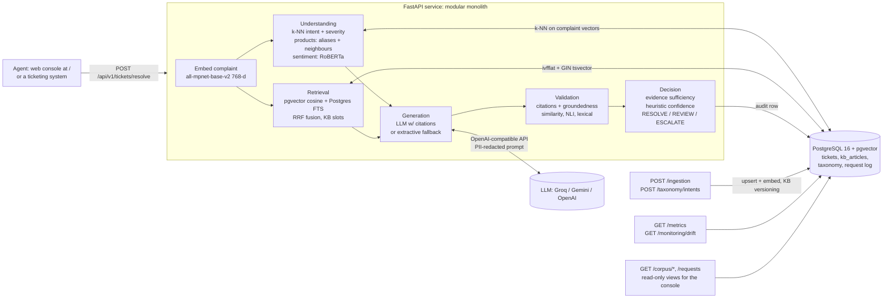

# Architecture

## 1. Problem framing

Support agents search past tickets and the KB by keyword ("router", "billing"). Keyword search misses tickets
that describe the **same root cause in different words** ("the web keeps cutting out" vs "broadband drops"), so
agents re-solve known problems, resolution quality varies by agent, and handle time grows.

The assistant takes a raw complaint and returns, in one call:

1. **Understanding**: intent/category, products, severity, customer sentiment.
2. **Evidence**: the most similar *resolved* tickets and KB articles (hybrid semantic + lexical search).
3. **A draft resolution**: numbered steps, each citing the sources it came from.
4. **Validation**: are the citations valid, and does each cited source actually support (or contradict) the step?
5. **An evidence-derived confidence score and a decision**: `RESOLVE` (use the draft), `REVIEW` (an agent should
   check it), or `ESCALATE` (evidence insufficient).

The design principle is that **the system should know when it doesn't know**. A wrong but confident draft is worse
than an escalation, so every number the agent sees comes from observable evidence, never from the LLM grading itself.

## 2. System diagram

Request flow and the latency budget of each stage are logged per request (`stage_latency_ms`). Understanding and
retrieval run **concurrently** because both depend only on the complaint embedding.

## 3. Components

| Service | Responsibility | Key implementation |
|---|---|---|
| `understanding` | intent, products, severity, sentiment | similarity-weighted k-NN over labelled history (pgvector), taxonomy prototypes, alias matching + neighbour-implied products, rule cues on top of neighbour severity, calibrated RoBERTa sentiment |
| `retrieval` | find similar resolved tickets + KB | pgvector cosine (ivfflat), PostgreSQL FTS with OR-of-terms `tsquery`, weighted RRF, KB minimum slots, optional cross-encoder rerank |
| `generation` | cited step-by-step draft | OpenAI-compatible provider (JSON mode, retries with backoff and `Retry-After`), PII redaction, injection-safe delimiters; deterministic extractive generator as fallback/baseline |
| `validation` | is each step supported by its citations? | citation parsing/validity; per-claim semantic similarity (chunk level), NLI entailment + contradiction (DeBERTa-v3 cross-encoder), lexical overlap; combined rule |
| `decision` | sufficiency, confidence, action | quality-based sufficiency (no source-count rule), weighted heuristic confidence, ordered decision rules |
| `ingestion` | evolving data | idempotent upserts, re-embedding on change, KB versions archived, runtime intent registration |
| `api/v1/corpus` | make retrieval inspectable | read-only SQL views of the corpus (counts, `pg_indexes`, rows with provenance and an embedding preview), raw semantic / lexical / hybrid retrieval through the same retriever the pipeline uses, request log |
| `static/` | agent console | plain HTML/CSS/JS served by FastAPI (no build step, no extra container): resolve flow, citation-to-source linking, knowledge-base browser, retrieval playground, metrics/drift drawer; all API text is HTML-escaped before rendering |
| `monitoring` | system health | metrics (latency percentiles, decision mix, groundedness, fallback rate, feedback), drift report (unknown-intent rate, intent-mix TVD, nearest-neighbour similarity) |

### 3.1 Database schema

Single PostgreSQL 16 database (`migrations/001_initial_schema.sql`); vectors live next to the rows they describe.

| Table | Purpose | Key columns | Indexes |
|---|---|---|---|
| `tickets` | historical tickets (retrieval corpus, k-NN labels) | `ticket_id` PK, `complaint`, `resolution`, `category`, `product`, `severity`, `sentiment`, `created_at`, provenance (`source`, `label_source`, `verified`, `split`), `metadata` JSONB, `embedding vector(768)` (complaint + resolution), `complaint_embedding vector(768)`, `text_search tsvector` (generated) | ivfflat on both vectors (`lists = √rows`, built after ingestion), GIN on `text_search`, b-tree on category / product / severity / source / created_at |
| `kb_articles` | KB procedures | `article_id` PK, `title`, `content`, `category`, `product`, `tags[]`, `version`, `metadata`, `embedding`, `text_search` | ivfflat, GIN, b-tree on category / product / updated_at |
| `system_meta` | facts about how the data was built | `key` PK, `value`: `embedding_model`, `embedding_dim`, `reembed_complete` | PK |
| `kb_article_versions` | superseded KB versions | (`article_id`, `version`) PK, `title`, `content`, `archived_at` | PK |
| `intent_taxonomy` | ticket classes, extensible at runtime | `intent_name` unique, `description`, `examples` JSONB, `parent_intent_id`, `active` | name, active |
| `product_taxonomy` | products and aliases | `product_name` unique, `category`, `aliases[]`, `active` | name, category, active |
| `resolution_requests` | audit and monitoring log, one row per request | `request_id` UUID, `complaint_hash`, `complaint_redacted` (PII-masked), extracted metadata, sources and relevance, draft, citations, citation accuracy / coverage, groundedness, confidence and components, decision and reason, flags, generator, latency and per-stage latency, agent feedback | created_at, decision, confidence |

Raw complaints are never stored: only a SHA-256 hash and a PII-redacted copy.

### 3.2 API design

REST over JSON, versioned under `/api/v1`; full reference with examples and error codes in
[docs/api.md](docs/api.md), interactive OpenAPI at `/docs`.

| Method | Path | Purpose |
|---|---|---|
| POST | `/tickets/resolve` | complaint → understanding, sources, cited steps, per-step validation, confidence (with components), decision, flags, per-stage latency |
| POST | `/tickets/{request_id}/feedback` | agent rating (1–5) of a draft, stored for future confidence calibration |
| POST | `/ingestion` | upsert tickets and KB articles (idempotent; re-embeds changed rows; versions KB edits; per-row errors) |
| GET / POST | `/taxonomy/intents` | list / register ticket classes at runtime |
| GET | `/health` | DB connectivity, models loaded, LLM configured or fallback, corpus size |
| GET | `/metrics` | volume, decision mix, latency p50/p95/p99, groundedness, citation quality, fallback rate, feedback |
| GET | `/monitoring/drift` | recent vs baseline: unknown-intent rate, intent-mix TVD (size-aware threshold), nearest-neighbour similarity, alerts |
| GET | `/corpus/stats`, `/corpus/tickets[/{id}]`, `/corpus/kb[/{id}]`, `/corpus/search`, `/requests` | read-only knowledge-base views used by the console to show what RAG retrieves from |

Design choices: one synchronous resolve call (the agent is waiting, p50 1–5 s, so no job queue is needed at this
scale); Pydantic models validate size limits (complaint 10–5,000 chars, batch ≤ 5,000 tickets); every response
carries `x-request-id` (client-supplied or generated) and `x-process-time-ms`; failures in monitoring writes never
fail the request.

## 4. Design decisions and alternatives

Each decision lists what was rejected and why. Where an experiment backs a decision, the result is in
[EXPERIMENTS.md](EXPERIMENTS.md).

### 4.1 Modular monolith, not microservices
Six services with clean interfaces (dataclasses in `app/models/schemas.py`) inside one FastAPI process.
*Rejected:* one deployable per service. At this scale it adds network hops (latency), distributed failure modes and
operational load for no benefit. Every service already takes its dependencies by injection
(`app/api/v1/dependencies.py`), so extracting e.g. validation into a GPU-backed worker is a deployment change, not a rewrite.

### 4.2 PostgreSQL + pgvector as the only datastore
Tickets, KB, vectors, full-text indexes, taxonomy and the audit log in one ACID database. One backup, one access
control model, and transactional ingestion (a ticket and its vectors are written together).
*Rejected:* a dedicated vector DB (Pinecone, Qdrant, Weaviate). Its strength is scale beyond ~10⁷ vectors or
very high QPS, neither of which applies here, and it would split the source of truth. Migration path: §6.

### 4.3 Hybrid retrieval (semantic + PostgreSQL FTS, RRF)
Semantic search handles paraphrase; lexical search handles exact tokens that embeddings blur (error codes like
`DNS_PROBE_FINISHED`, "LOS", "PAC code", port numbers). RRF fuses rankings without calibrating incomparable
scores. The lexical side is **PostgreSQL full-text search (`ts_rank`), not BM25**.
*Findings that shaped the implementation (E1):* `plainto_tsquery` ANDs every term and returned **zero** results
for all 200 eval complaints, so lexical search uses an OR-of-content-terms `tsquery` ranked by `ts_rank`. Fusion
happens over **one** semantic and **one** lexical ranking spanning tickets and KB articles. Fusing per table and
interleaving lets the #1 of 40 KB articles tie the #1 of 2,000 tickets (the first E1 run caught this). Weights
0.9 semantic / 0.1 lexical were chosen on the dev split (0.8 / 0.2 with the earlier MiniLM embeddings: stronger
semantic retrieval leaves less for lexical search to add). Measured gain over semantic-only: nDCG@10 +0.014
(p = 0.0005), MRR +0.041 (p = 0.003), P@5 +0.018 (p = 0.0005), for about +80 ms median latency. KB articles are guaranteed 2 of the top-k slots rather than
competing on score, because agents want the canonical procedure even when near-duplicate tickets outrank it. Measured:
the scenario's KB article reaches the generator's 8-source context for 87% of complaints with the slots vs 14% without.

### 4.4 Relevance used for evidence is cosine similarity, not the RRF score
RRF scores (~1/(60+rank)) only order results; they say nothing about *how* relevant the best hit is. Evidence
sufficiency and confidence need an absolute signal, so the retriever computes query↔document cosine for every
returned document, including lexical-only hits.

### 4.5 Intent: k-NN over labelled history (default), LLM optional
"Handle evolving data and ticket classes" is a hard requirement. A k-NN vote over historical tickets (complaint-only
embeddings in pgvector) recognises a new class **as soon as its tickets are ingested**, with no retraining or
redeploy, and every prediction is explainable ("these 15 similar tickets were mostly X"). The same neighbours supply
severity and implied products. *Alternatives:* a fine-tuned classifier needs retraining for every new class;
zero-shot NLI (bart-large-mnli) is slow on CPU and weak on domain labels; an LLM classifier costs latency and money
per request and is rate-limited on free tiers (it is available via `INTENT_CLASSIFIER=llm`).
*Measured limitation:* the vote share is a weak novelty detector (see EVALUATION.md §2.3), so unknown classes are
also caught downstream (low relevance or groundedness leads to ESCALATE) and by drift monitoring.

### 4.6 Generation: citation-constrained LLM with an extractive fallback
The prompt requires `[N]` citations on every step and forbids advice absent from the sources. Complaint text is
PII-redacted before leaving the service and is wrapped in delimiters marked as data (prompt-injection mitigation).
Instruction-like complaints are flagged and forced to `REVIEW`. When the LLM is unavailable (no key, 429s, outage),
a deterministic **extractive generator** selects resolution actions that recur across sources and cites each one,
so the service degrades instead of failing. The fallback rate is a monitored metric.

### 4.7 Groundedness: multi-method, not similarity alone
Per claim, against the sources it cites: (1) max cosine to source *sentences*, (2) NLI entailment **and
contradiction** probabilities (DeBERTa-v3-small cross-encoder) with single sentences as premises, (3) stemmed
content-word overlap, plus (4) a quotation rule: a claim quoted verbatim from a cited source is supported without
NLI. Contradiction is read from the premise most similar to the claim, not the maximum over all premises. The
combined rule is in `decide_support()`.
Two measured reasons for this design (EXPERIMENTS.md E3): similarity alone cannot see polarity ("disable 5 GHz" is
as similar to the source as a correct paraphrase), and NLI misreads *imperative* fix steps when the premise is a
multi-sentence chunk: it called verbatim-supported steps neutral and merely different steps contradictions,
which flagged 88% of real drafts in the first version. Held-out F1 for detecting not-supported claims: 0.918
(re-confirmed after the embedding switch; validation keeps MiniLM, §4.11).
NLI model choice: `cross-encoder/nli-deberta-v3-small` instead of the plan's `roberta-large-mnli` (about 1.4 GB, several times
slower on CPU); configurable via `NLI_MODEL`.

### 4.8 Evidence-derived heuristic confidence
`0.30·retrieval_quality + 0.40·evidence_quality + 0.20·understanding_quality + 0.10·sufficiency`, all from
observable signals (cosine relevance, citation accuracy/coverage, groundedness, k-NN vote share). It is explicitly
**not a probability** and **not LLM self-assessment**. The API response says so. Agent feedback
(`POST /tickets/{id}/feedback`) is stored to fit a calibration map later. The generation eval measures whether the
score separates good drafts from bad ones (AUROC).

### 4.9 Evidence sufficiency is quality-based
No "at least two sources" rule: one relevant, well-grounded KB article is enough. Insufficient means: low top or
average relevance, no steps, any contradicted step, groundedness below threshold, or no authoritative source
(unresolved tickets don't count).

### 4.10 Decision rules (ordered)
insufficient evidence → ESCALATE; unknown intent → REVIEW; suspected injection → REVIEW; critical severity → REVIEW;
confidence ≥ 0.75 → RESOLVE; ≥ 0.55 → REVIEW; else ESCALATE. All thresholds are in `app/config.py`.

### 4.11 Embedding models: mpnet where it wins, MiniLM where it is enough
*Retrieval and understanding: `all-mpnet-base-v2` (768-d).* Experiment 4 compared three models on the E1 queries:
mpnet beat the original `all-MiniLM-L6-v2` by +0.16 nDCG@10 (p < 0.001); `bge-small-en-v1.5` was worse. After
the switch and a full re-baseline, deployed hybrid retrieval went from nDCG@10 0.572 to 0.729 and Recall@10 from
0.558 to 0.726, and intent macro-F1 from 0.723 to 0.889, because the k-NN classifier uses the same embeddings.
*Groundedness validation: `all-MiniLM-L6-v2` (`VALIDATION_EMBEDDING_MODEL`).* Validation embeds every sentence of the
cited sources (~80 per request) to choose the premises NLI checks. E3 found validation quality equal with either
model (F1 0.918 MiniLM vs 0.927 mpnet on the same grid, one item in 100), while mpnet was 6x slower on that
workload (4.8 s vs 0.8 s per request on 2 CPU cores). Keeping MiniLM there kept end-to-end latency at p50 0.9 s.
*Evaluation metric: MiniLM, fixed (`METRIC_EMBEDDING_MODEL`).* Reference-step matching keeps the model its 0.6
threshold was defined with, so before/after numbers measure the system, not a moved yardstick.
*Re-tuning.* Thresholds with a tuning procedure were re-tuned on the dev split (E1 fusion weights, E3 grid, unknown-
intent sweep); the four scale-only floors were translated by matching score distributions on dev complaints
(`experiments/recalibrate_thresholds.py`). *Cost:* 2x vector storage, ~2x query-embedding time, larger image.
*Side effect:* unseen issue types also look more familiar (extractive RESOLVEs on novel complaints 48% to 52%),
which keeps the intent-mix drift alert essential.

## 5. Deviations from IMPLEMENTATION_PLAN.md (with justification)

| Plan | Implemented | Why |
|---|---|---|
| GPT-4o-mini | Any OpenAI-compatible endpoint; evaluated with Groq free tier: generator `qwen/qwen3.8-27b`, judge `openai/gpt-oss-120b`; extractive fallback | Owner chose a free-tier LLM; the abstraction keeps GPT-4o-mini one env var away. Qwen: lowest latency and token use under the 8k tokens/min free-tier cap (gpt-oss spends hundreds of hidden reasoning tokens per call). The judge is a different model family to reduce self-preference bias |
| LLM / zero-shot intent | k-NN default, LLM optional | Evolving classes without retraining; latency; free-tier limits (§4.5) |
| `roberta-large-mnli` | `nli-deberta-v3-small` (configurable) | CPU latency and memory (8 GB dev machine) |
| `plainto_tsquery` | OR-of-terms `tsquery` (AND kept as option) | AND semantics return ~nothing for long complaints (E1) |
| RRF scores as retrieval_scores in confidence | cosine relevance per doc | RRF scores are not absolute (§4.4) |
| `citation_coverage = len(citations)/len(citations)` | steps with ≥1 valid citation / all steps | Plan formula always equals 1.0 |
| Groundedness over cited claims only | uncited steps count as unsupported | Stricter: an uncited step is unverifiable |
| ivfflat created in schema | created after ingestion, `lists = √rows` | Plan §15.2: lists depends on the real row count |
| `label_source ∈ {dataset_native, llm_labeled, human_verified}` | `generator_by_construction` | Labels come from the generator's scenario, which is neither of the plan's categories; stated honestly |
| Very negative sentiment bumps medium → high severity | Disabled by default (configurable) | Measured on the dev split: severity accuracy 0.749 without the bump vs 0.558 with it. Severity reflects impact, not tone |
| Argmax sentiment label | Polarity thresholds calibrated on dev | Complaints describe problems, so argmax labels nearly everything negative (EVALUATION.md §2) |
| Dictionary product extraction | + products implied by same-class neighbours | Complaints often imply a product without naming it ("the web keeps cutting out"); dev product F1 0.385 → 0.767 |
| `all-MiniLM-L6-v2` for all embeddings | `all-mpnet-base-v2` for retrieval/understanding; MiniLM kept for validation and the evaluation metric | Plan's own E4 rule (switch on a significant improvement: +0.16 nDCG@10); validation quality is equal with MiniLM at 1/6 of the cost (§4.11) |
| Single `embedding` column | + `complaint_embedding` | k-NN intent must compare complaint to complaint, not to complaint+resolution |
| "Real-time agent UI" out of scope (API only) | Web console at `/` plus read-only knowledge-base endpoints (`/corpus/*`, `/requests`) | Added at the project owner's request so a reviewer can see what RAG retrieves from; plain HTML/CSS/JS served by the API, no extra service. The corpus endpoints are unauthenticated like the rest of this demo API and belong behind auth in production |
| `POST /ingestion/tickets` | `POST /ingestion` | One idempotent endpoint accepts tickets and KB articles together |
| Public dataset first, synthetic as augmentation (§12.1) | Scenario-based synthetic corpus only | Both suggested public datasets were measured and rejected for retrieval (EVALUATION.md §1): one is not support data, the other has few actionable answers and is not telecom |
| Human evaluation of 50 drafts (Tier 2) | Same 50-row sheet rated by an AI rater (Claude), clearly labelled; the human sheet is unchanged and still open | The project owner asked for the sheet to be filled automatically; results are reported as AI ratings, never as human ones (EVALUATION.md §6.4) |
| `circuitbreaker` package for DB calls | Small in-house breaker (`app/core/resilience.py`) around the two database stages | Needs async support, a per-request trial allowance and selective failure types; ~70 lines, fully unit-tested |

## 6. Production considerations

**Latency.** Stage timings are logged per request. Validation caches the sentence embeddings of cited sources
across requests (keyed by a hash of the source text, bounded LRU), since the same KB articles and tickets are cited
again and again. On CPU, the dominant costs are the LLM call (network-bound) and
NLI validation (about 0.5 s per claim measured in E3, so a 5-step draft costs roughly 2-3 s). Levers, in order: batch all claim/chunk
NLI pairs in one forward pass, run NLI on GPU or a smaller model, cache embeddings of KB chunks (static), and stream
the draft to the agent while validation completes.

**Throughput and scaling.** The API is stateless; models are loaded once per process. Scale horizontally behind a
load balancer. CPU inference is the bottleneck, so a GPU validation worker is the first extraction candidate. LLM
throughput is bounded by the provider's rate limit; retries honour `Retry-After` and the extractive fallback keeps
the service up when the quota is exhausted.

**Data scale.** ivfflat is sized from the row count (`lists = √n`) and probes are configurable. Path: up to ~10⁶
vectors, keep ivfflat or HNSW in pgvector, add read replicas for retrieval and pgBouncer. Beyond that, or at high QPS,
move vectors to a dedicated ANN service, keeping Postgres as the system of record. Partition tickets by time; old
tickets matter less for resolution.

**Evolving data.** Ingestion is incremental and idempotent: changed resolutions are re-embedded, KB edits create a
new version and archive the old one, and new intents can be registered via API. k-NN classification and retrieval
pick up new rows immediately. The drift endpoint watches for the signature of a new ticket class (rising
unknown-intent rate, falling nearest-neighbour similarity, intent-mix shift).

**Changing the embedding model.** Stored vectors only mean something for the model that produced it, so a model
change is handled by the data layer, not by hand: `system_meta` records the model, and `scripts/reembed.py` runs
on every container start. If the configured model differs, it resizes the vector columns (if the dimension
changed), re-embeds every row in small committed batches (resumable; `--max-minutes` fits it into job slots),
rebuilds the ivfflat indexes and records the new model; otherwise it is a no-op that loads no model. The drift
report only compares requests embedded by the current model, because similarities from different models are not
comparable. The MiniLM to mpnet switch re-embedded 2,083 documents (4,126 vectors) in about 25 minutes on 2 CPU
cores; results before the switch are kept in `experiments/results/minilm_baseline/`.

**Reliability.** Connection-level retries in the HTTP transport (connect errors and resets only, never a request that reached the server) plus request-level retries with exponential backoff and `Retry-After` handling on LLM calls; optional IPv4 pinning (`LLM_FORCE_IPV4`) for networks that advertise IPv6 but drop it (seen on the dev machine as `WinError 64` resets); non-retryable 4xx fail fast; extractive fallback;
monitoring writes never break the request path; savepoints so one bad ingestion row doesn't abort a batch;
DB pool pre-ping and recycling; container health checks. Stage-level fallbacks and the database circuit
breaker are described in §6.1.

**Security and privacy.** PII (emails, phones, card and account numbers) is redacted before LLM calls and in the
audit log (which stores a hash plus a redacted complaint). Prompt-injection heuristics flag instruction-like input and
force human review. User text is delimited and its tags neutralised. Input size limits come from Pydantic models.
Secrets live in env vars and `.env` is gitignored. Missing for production: authN/Z on the API (e.g. OAuth2 or JWT at the gateway),
rate limiting per client, encryption at rest, data-retention policy for the request log.

**Observability.** Structured JSON logs with a per-request correlation id (`x-request-id`), per-stage latency, LLM
token usage and latency, decision mix, groundedness, fallback rate, agent feedback, and drift. `/metrics` returns
JSON; exporting the same to Prometheus/Grafana is a Tier-3 extension.

### 6.1 Failure handling (graceful degradation)

A failing dependency never becomes an error for the agent: each stage has a safe fallback and a flag in the
response (`app/services/pipeline.py`, tests in `tests/unit/test_degradation.py`).

| Failure | What the agent gets | Flag |
|---|---|---|
| LLM down, rate-limited or invalid output | extractive draft from the same sources, validated as usual; a daily-quota 429 fails over at once, other waits are capped (10 s on 429s, 45 s overall) | `llm_unavailable_extractive_fallback` |
| Database down, a query slower than `DB_QUERY_TIMEOUT_S` (10 s), or circuit open | no LLM call; ESCALATE "Knowledge base unavailable" | `retrieval_unavailable` |
| Understanding fails | intent treated as unknown, so the decision is at most REVIEW; retrieval and drafting continue | `understanding_unavailable` |
| Generator crashes | no draft; ESCALATE | `generation_error` |
| Validation model fails | draft returned with every step marked `unverified`; never RESOLVE, REVIEW when sources are relevant | `validation_unavailable` |
| Embedding model fails | ESCALATE | `embedding_unavailable` |
| Audit-log write fails | logged, the response is still returned; skipped while the circuit is open; write failures don't trip the breaker (answering needs reads, not the log) | (none) |

**Circuit breaker.** Understanding and retrieval queries run through one database breaker. After
`DB_CIRCUIT_FAILURE_THRESHOLD` (5) consecutive database failures (connection errors, SQL errors, query timeouts) it opens
and requests are escalated immediately instead of each waiting for a timeout and exhausting the pool. After
`DB_CIRCUIT_RECOVERY_S` (30 s) two trial calls (one request) are let through; success closes it. Errors that are not
database failures (bugs) still degrade the request but don't trip the breaker. `/health` reports
`database_circuit` and turns `degraded` while it is open. The timeout is applied to the database round trips only
(k-NN, retrieval, audit write), never to model inference, so a slow CPU cannot be mistaken for a database outage.
An earlier version timed the whole understanding stage and did exactly that once during an evaluation run (cold
start: sentiment model plus first connection); that case was discarded and re-run.

### 6.2 Deliberately not built (Tier 3), and when we would add it

| Component | Why not now | Add it when |
|---|---|---|
| Redis cache (embeddings, LLM answers) | identical complaints rarely repeat; time goes to CPU inference and LLM rate limits, which a cache does not fix | the repeat-complaint rate (measurable from `complaint_hash` in the request log) is high enough to pay off, e.g. during a known outage |
| Celery / job queue | the agent waits for the draft (1-5 s), so a queue only adds latency and infrastructure | bulk work appears: re-embedding the corpus after a model change, nightly batch drafting, large ingestion jobs |
| Prometheus + Grafana | `/metrics`, `/monitoring/drift`, structured logs and the console's Insights panel cover a single deployment | there are several replicas to aggregate, or on-call alerting is needed (export the same numbers via a Prometheus endpoint) |
| Fine-tuned classifiers | trained on templated synthetic data they would learn the templates; k-NN takes new classes without retraining (E4′) | there is enough real, labelled ticket history and intent F1 is the bottleneck |
| Service extraction | a modular monolith is simpler to run and debug at this size (§4.1) | one stage needs different hardware or scaling, first candidate: NLI validation on a GPU worker |
| Advanced confidence calibration | needs human labels first | the human ratings (EVALUATION.md §6.4) and agent feedback exist; then fit isotonic/Platt and run Experiment 5 |

## 7. Known limitations

* The dataset is **synthetic** (template-generated from 43 hand-written scenarios). Labels are correct by
  construction but the language is less varied than real tickets. Absolute metric values will not transfer to
  production data; the *comparisons* (hybrid vs semantic, multi-method vs similarity) are the transferable part.
  The suggested public datasets were measured and not used (EVALUATION.md §1).
* Novel-intent detection from k-NN vote share is weak (EVALUATION.md §2.3), and better embeddings made unseen
  complaints look more familiar, not less (§4.11); the intent-mix drift alert is the reliable signal.
* Heuristic confidence is uncalibrated until agent feedback is collected.
* Single-language (English) FTS configuration.
