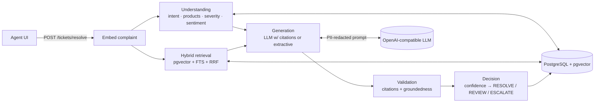

# Telecom Support Ticket Resolution Assistant

Prodapt AI Engineering evaluation, **Use Case 2: Intelligent Support Ticket Resolution Assistant**.

An agent pastes a raw customer complaint and gets structured understanding, the most similar resolved tickets and
KB articles, a cited step-by-step resolution, validation of every step, and a decision. Real output from the
containerized service (Groq LLM generator):

> *"The fibre box on the wall has a red LOS light and we have had no internet since this morning. I work from home."*

* **Understanding**: intent `connectivity_issue`, products `[fiber, broadband]`, severity `critical`, sentiment `neutral`
* **Resolution** (each step cites the sources it came from; all steps validated as grounded):
  1. Check the thin fibre cable into the ONT for sharp bends, kinks or pinching and straighten it. `[2][3][4][5][6][7]`
  2. Make sure the green fibre connector is fully clicked into the ONT port without touching the fibre end. `[1]…[7]`
  3. Check the outage map for a fibre fault in the area. `[1]…[8]`
  4. If LOS stays red and there is no area-wide outage, raise a fibre fault and dispatch a field engineer. `[4][6][7]`
* **Decision**: `REVIEW` (critical severity always gets a human check), heuristic confidence 0.99, groundedness 1.0, 7.1 s

It does not always get it right: the problem statement's own example complaint gets a fluent, fully cited answer from
the *wrong* scenario. That case is analysed in [EVALUATION.md §6.3](EVALUATION.md).

| Document | Contents |
|---|---|
| [ARCHITECTURE.md](ARCHITECTURE.md) | diagram, components, design decisions + rejected alternatives, deviations from plan, production considerations |
| [EVALUATION.md](EVALUATION.md) | datasets, leakage checks, understanding / retrieval / generation / system metrics, baseline comparison |
| [EXPERIMENTS.md](EXPERIMENTS.md) | E1 retrieval methods, E2 reranking, E3 groundedness methods; hypotheses, procedure, measured results, decisions |
| [docs/api.md](docs/api.md) | endpoint reference with examples (interactive docs at `/docs`) |
| [data/DATASET_STATISTICS.md](data/DATASET_STATISTICS.md) | actual dataset sizes, provenance, splits |
| [docs/setup.md](docs/setup.md) · [docs/deployment.md](docs/deployment.md) · [docs/troubleshooting.md](docs/troubleshooting.md) | local setup and config reference · deployment, sizing, scaling · problems actually hit and their fixes |

## Results at a glance

All measured on held-out data (synthetic telecom tickets; eval phrasings never appear in the corpus). Details and
caveats in [EVALUATION.md](EVALUATION.md) and [EXPERIMENTS.md](EXPERIMENTS.md).

| What | Result |
|---|---|
| Finding a highly relevant past ticket in the top 5 | keyword search (status quo) **40.5%** → hybrid retrieval **76.0%** |
| Hybrid vs semantic-only retrieval | MRR +0.057 (p = 0.0005); reranking adds +0.052 P@5 but +2.7 s on CPU, so kept off (E2) |
| Groundedness check, F1 at catching unsupported/contradicted steps | **0.918** multi-method vs 0.694 similarity-only (E3) |
| Understanding (500 complaints) | intent acc 0.724 · products F1 0.716 · severity acc 0.784 · sentiment acc 0.790 |
| New ticket class, no retraining | 0% → **85%** recognised after ingestion; caught beforehand by the intent-mix drift alert (E4′) |
| LLM drafts (Groq `qwen3.8-27b`, 52 cases) | groundedness 0.955 · RESOLVE drafts recover 79% of reference steps, ESCALATE 20% · confidence AUROC 0.80 |
| Unseen issue type (60 complaints) | confident wrong answers: 48% with extractive drafts → **22% with an LLM** that declines when sources don't fit |
| Latency / load (1 worker, laptop CPU) | p50 1.0 s without LLM, 5.5 s with the free-tier LLM (p95 15.4 s, rate-limit waits) · ~1 req/s per worker, 0% errors at concurrency 8 |
| Known failure mode | "grounded but wrong": a fluent, well-cited draft from the wrong scenario, documented with root cause (EVALUATION.md §6.3) |
| Deployment | `docker compose up --build` verified end to end on the dev machine (image 3.7 GB, ~41 s cold start, offline model loading) |

## Features

* **Complaint understanding**: intent (k-NN over labelled history, new classes usable as soon as their tickets are
  ingested), products (aliases + implied by similar tickets), severity (similar tickets + urgency/impact cues),
  sentiment (calibrated RoBERTa).
* **Hybrid retrieval**: pgvector cosine + PostgreSQL full-text search fused with weighted RRF; guaranteed KB slots;
  optional metadata filters; optional cross-encoder reranking (off by default, per Experiment 2).
* **Cited RAG generation** through any OpenAI-compatible LLM (Groq, Gemini, OpenAI…), PII redacted before the call,
  prompt-injection hardening, and a deterministic extractive fallback when the LLM is unavailable.
* **Validation**: citation validity plus multi-method groundedness (sentence-level NLI entailment and contradiction,
  semantic similarity, lexical overlap, verbatim-quote rule).
* **Evidence-derived confidence and decisions**: RESOLVE / REVIEW / ESCALATE from retrieval relevance, citation
  quality, groundedness and understanding confidence. Never LLM self-assessment.
* **Evolving data**: incremental, idempotent ingestion; KB versioning; runtime registration of new ticket classes.
* **Operations**: health, metrics (latency percentiles, decision mix, groundedness, fallback rate, agent feedback),
  drift monitoring (unknown-intent rate, nearest-neighbour similarity, intent-mix shift), structured JSON logs with
  request ids, audit log of every resolution.

## Architecture



One FastAPI process with six service modules (understanding, retrieval, generation, validation, decision,
ingestion). Details, design decisions and rejected alternatives: [ARCHITECTURE.md](ARCHITECTURE.md).

## Technology stack

| Layer | Choice |
|---|---|
| API | Python 3.11, FastAPI, Pydantic v2, uvicorn |
| Database | PostgreSQL 16 + pgvector (ivfflat), PostgreSQL full-text search (tsvector, `ts_rank`), SQLAlchemy 2 async + asyncpg |
| Embeddings | `sentence-transformers/all-MiniLM-L6-v2` (384-d) |
| NLI (groundedness) | `cross-encoder/nli-deberta-v3-small` |
| Sentiment | `cardiffnlp/twitter-roberta-base-sentiment-latest` |
| Reranker (optional) | `cross-encoder/ms-marco-MiniLM-L-6-v2` |
| LLM | any OpenAI-compatible endpoint; evaluated with Groq `qwen/qwen3.8-27b`, `openai/gpt-oss-20b/120b` and Gemini 3 Flash |
| Packaging | Docker (CPU-only torch, models baked in), Docker Compose |
| Quality | pytest + pytest-asyncio + pytest-cov, black, flake8, mypy |

## Dataset

2,043 historical tickets and 40 KB articles generated from 43 hand-written telecom root-cause scenarios, plus a
held-out "wave 2" ticket class for the evolving-data experiment. Evaluation complaints use phrasings that never
appear in the corpus; leakage checks report zero overlap. Provenance and label source are recorded on every row.
Full statistics: [data/DATASET_STATISTICS.md](data/DATASET_STATISTICS.md). Why synthetic, and what that means for
the numbers: [EVALUATION.md §1](EVALUATION.md).

## Quick start (Docker)

```bash
cp .env.example .env          # optional: add LLM_API_KEY (Groq or Gemini free tier)
docker compose up --build     # Postgres+pgvector, schema, data ingestion, API on :8000
```

The first boot generates the synthetic dataset (if missing), embeds and ingests it, and builds the ANN indexes
(a couple of minutes on CPU). Then:

```bash
curl -s localhost:8000/api/v1/health
curl -s -X POST localhost:8000/api/v1/tickets/resolve -H "Content-Type: application/json" \
  -d '{"complaint": "My broadband drops every evening around 8 and I have already restarted the router twice. I work from home and this is costing me."}'
```

Open http://localhost:8000/docs for the interactive API.

Without an `LLM_API_KEY` the service runs in **extractive mode**: steps are selected from the retrieved sources and
cited, with no LLM involved. The response's `resolution.generator` field says which generator produced the draft.

> **Windows note:** Docker Desktop stores images on C: by default. The API image is 3.7 GB (CPU torch + baked models).
> If C: is short on space, set Docker Desktop → Settings → Resources → Advanced → *Disk image location* to another drive.
> On an 8 GB machine, cap the Docker/WSL VM so Windows keeps headroom: `%USERPROFILE%\.wslconfig` with `[wsl2]` / `memory=3GB` (Postgres + API fit comfortably).

## Local development (without Docker for the API)

```bash
python -m venv .venv && .venv/Scripts/activate          # Linux/macOS: source .venv/bin/activate
pip install torch --index-url https://download.pytorch.org/whl/cpu
pip install -r requirements.txt

docker compose up -d db                     # just the database
python scripts/generate_synthetic.py        # deterministic (seed 42)
python scripts/verify_splits.py             # leakage checks: corpus vs eval sets
python scripts/init_db.py                   # schema
python scripts/ingest.py                    # embed + ingest + build ivfflat indexes
python scripts/report_dataset_stats.py      # writes data/DATASET_STATISTICS.md
uvicorn app.main:app --reload
```

## Tests and quality

```bash
pytest --cov=app                 # 69 tests; unit + API run offline (fake embedder/NLI), DB tests skip without a DB
pytest -m db                     # DB integration tests only (needs the database running)
black --check . && flake8 && mypy app scripts evaluation experiments tests
locust -f tests/load/locustfile.py --host http://localhost:8000   # optional interactive load test
```

Current status: 69 passed, black / flake8 / mypy clean (coverage below).

## Evaluations and experiments

```bash
python experiments/e3_groundedness.py                       # E3, no DB needed
python evaluation/understanding_eval.py --index pg          # intent / product / severity / sentiment
python experiments/e1_retrieval.py                          # E1: keyword vs lexical vs semantic vs hybrid
python experiments/e2_reranking.py                          # E2: cross-encoder reranking decision
python evaluation/generation_eval.py --generator extractive # end-to-end, no LLM
python evaluation/generation_eval.py --generator llm --delay 2   # end-to-end with the LLM (free-tier pacing)
python evaluation/system_eval.py --url http://localhost:8000     # latency / throughput / error rate
python experiments/evolving_classes.py --extractive        # new ticket class arrives: before/after ingestion
python evaluation/retrieval_eval.py                         # deployed retriever configuration
python scripts/run_experiments.py                           # all of the above in a safe order (see --help)
python evaluation/human_eval_analysis.py                    # after filling data/evaluation/human_eval_sheet.xlsx
```

Every script writes its raw output to `experiments/results/*.json`. The numbers quoted in the docs come from those files.

## Repository layout

```
app/
  api/v1/          routes, request/response models, service container
  core/            database, LLM provider abstraction, prompts, logging
  models/          internal dataclasses, embedding service
  services/        understanding, retrieval, generation, validation, decision, ingestion, pipeline, monitoring
  utils/           text processing, PII redaction, injection heuristics
data/
  taxonomies/      intents.json, products.json
  processed/       generated corpus (tickets, KB; wave-2 = new ticket class)
  evaluation/      held-out eval sets, TREC qrels, leakage report
scripts/           generate_synthetic, verify_splits, init_db, ingest, report_dataset_stats, datagen/scenarios.py
evaluation/        metrics, understanding/retrieval/generation/system evals, keyword baseline
experiments/       E1-E3 (+ evolving classes), results/*.json
tests/             unit/ (offline), integration/ (API with in-memory container; DB tests marked `db`)
migrations/        SQL schema
```

## API summary

| Method | Path | Purpose |
|---|---|---|
| POST | `/api/v1/tickets/resolve` | complaint → understanding, sources, cited resolution, validation, confidence, decision |
| POST | `/api/v1/tickets/{request_id}/feedback` | agent rating of a draft (for future confidence calibration) |
| POST | `/api/v1/ingestion` | add/update resolved tickets and KB articles (incremental, versioned) |
| GET/POST | `/api/v1/taxonomy/intents` | list / register ticket classes at runtime |
| GET | `/api/v1/health` | DB, models, LLM status, corpus size |
| GET | `/api/v1/metrics` | volume, decision mix, latency p50/p95/p99, groundedness, fallback rate, feedback |
| GET | `/api/v1/monitoring/drift` | unknown-intent rate, intent-mix shift, nearest-neighbour similarity, alerts |

## License

[MIT](LICENSE)
